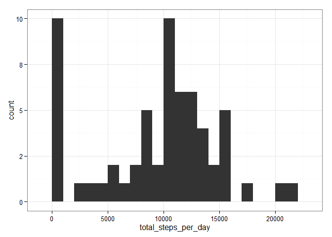
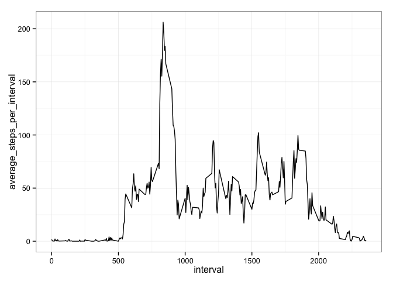
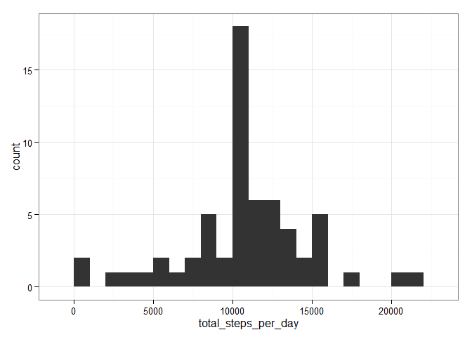
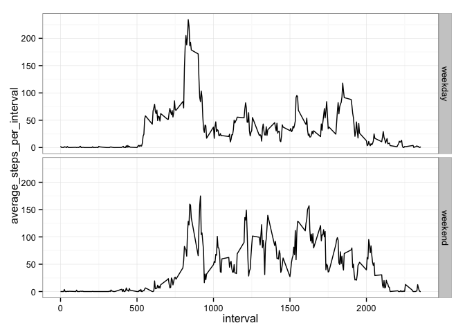

# Reproducible Research: Peer Assessment 1

## Loading the required packages and setting some global options


```r
library(dplyr)
library(ggplot2)

options(scipen = 1, digits = 0)
```

## Loading and preprocessing the data

Read the data into a data frame from the zipped csv file and transform the columns to the most appropriate class.


```r
data = read.csv(unz("activity.zip", "activity.csv"), colClasses = c("numeric", "Date", "numeric"))
```

Check the column transformations and the number of rows (it should be 17568!).


```r
str(data)
```

```
## 'data.frame':	17568 obs. of  3 variables:
##  $ steps   : num  NA NA NA NA NA NA NA NA NA NA ...
##  $ date    : Date, format: "2012-10-01" "2012-10-01" ...
##  $ interval: num  0 5 10 15 20 25 30 35 40 45 ...
```


## What is mean total number of steps taken per day?

Group and summarise the data dy day using dplyr functions and plot the histogram of the total number of steps taken per day.


```r
data = tbl_df(data)

total_steps_per_day = data %>%
  group_by(date) %>%
  summarise(total_steps_per_day = sum(steps, na.rm = TRUE))

ggplot(total_steps_per_day, aes(x = total_steps_per_day)) +
  geom_histogram(binwidth = 1000) +
  theme_bw()
```

 

```r
mean_total_steps_per_day = summarise(total_steps_per_day, val = mean(total_steps_per_day))

mean_total_steps_per_day
```

```
## Source: local data frame [1 x 1]
## 
##    val
## 1 9354
```

```r
median_total_steps_per_day = summarise(total_steps_per_day, val = median(total_steps_per_day))

median_total_steps_per_day
```

```
## Source: local data frame [1 x 1]
## 
##     val
## 1 10395
```

The mean and median total number of steps taken per day are 9354 and 10395, respectively.

## What is the average daily activity pattern?

Group and summarise the data by interval using dplyr functions and plot the average daily activity pattern.


```r
average_steps_per_interval = data %>%
  group_by(interval) %>%
  summarise(average_steps_per_interval = mean(steps, na.rm = TRUE))

ggplot(average_steps_per_interval, aes(x = interval, y = average_steps_per_interval)) +
  geom_line() +
  theme_bw()
```

 

```r
interval_with_max_average_steps = average_steps_per_interval %>%
  filter(average_steps_per_interval == max(average_steps_per_interval)) %>%
  select(interval)

interval_with_max_average_steps
```

```
## Source: local data frame [1 x 1]
## 
##   interval
## 1      835
```

The interval with the max number of steps taken, averaged across all days, is 835.

## Imputing missing values

Filter and summarise the missing values in the data using dplyr functions.


```r
total_missing = data %>%
  filter(is.na(steps)) %>%
  summarise(val = n())

total_missing
```

```
## Source: local data frame [1 x 1]
## 
##    val
## 1 2304
```

The total number of missing values is 2304.

Create a new dataset from the original one by replacing the missing values with the mean number of steps taken, averaged across all days, for that interval.


```r
new.data = data %>%
  group_by(interval) %>%
  mutate(steps = ifelse(is.na(steps), mean(steps, na.rm = TRUE), steps))
```

Group and summarise the new dataset dy day using dplyr functions and plot the histogram of the total number of steps taken per day.


```r
new.total_steps_per_day = new.data %>%
  group_by(date) %>%
  summarise(total_steps_per_day = sum(steps, na.rm = TRUE))

ggplot(new.total_steps_per_day, aes(x = total_steps_per_day)) +
  geom_histogram(binwidth = 1000) +
  theme_bw()
```

 

```r
new.mean_total_steps_per_day = summarise(new.total_steps_per_day, val = mean(total_steps_per_day))

new.mean_total_steps_per_day
```

```
## Source: local data frame [1 x 1]
## 
##     val
## 1 10766
```

```r
new.median_total_steps_per_day = summarise(new.total_steps_per_day, val = median(total_steps_per_day))

new.median_total_steps_per_day
```

```
## Source: local data frame [1 x 1]
## 
##     val
## 1 10766
```

The new mean and median total number of steps taken per day are 10766 and 10766, respectively. Compared to the original dataset, both mean and median are higher because the missing values (which are counted as zeros) have been replaced by the mean number of steps taken, averaged across all days, which can be higher than zero. This can also be observed as the decreased height of the zero bin column in the new histogram compared with the original one.

## Are there differences in activity patterns between weekdays and weekends?

Add a column indicating whether the date is a weekday or a weekend, then group and summarise the data by interval using dplyr functions and plot the average daily activity pattern for weekday and weekend.


```r
new.average_steps_per_interval = data %>%
  mutate(weekday.or.weekend = factor(weekdays(date) %in% c('Saturday', 'Sunday') + 0L, levels=c(0,1), labels=c('weekday','weekend'))) %>%
  group_by(interval, weekday.or.weekend) %>%
  summarise(average_steps_per_interval = mean(steps, na.rm = TRUE))

ggplot(new.average_steps_per_interval, aes(x = interval, y = average_steps_per_interval)) +
  facet_grid(weekday.or.weekend ~ .) +
  geom_line() +
  theme_bw()
```

 

As expected, the weekend activity pattern is shifted to the right (later time) compared to the weekday activity pattern.
